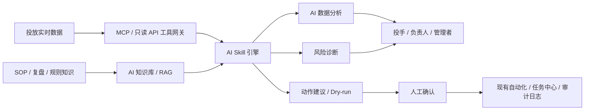

# SSTL AI 中台详细 PRD

## 1. 文档信息

- 文档版本：v1.0
- 适用范围：SSTL 搜索套利投放中台之上的 AI 能力层，第一期重点覆盖数据分析闭环
- 目标读者：老板、产品、设计、前端、后端、算法/AI、测试、投放运营负责人
- 关联文档：
  - `docs/sstl-detailed-product-prd.md`
  - `docs/v1-technical-design.md`
  - `docs/v1-openapi.yaml`
  - `docs/v1-schema.sql`

## 2. 背景与目标

SSTL 当前产品方向是从“投放配置 + 报表系统”升级为“搜索套利投放操作系统”。现有规划已经包含内部 Campaign、Offer 权重分发、重定向日志、收益闭环、自动化 dry-run、素材 AI 和 TONIC 合规。

AI 中台不是单独做一个聊天机器人，而是在现有投放操作系统上增加一层“智能分析与决策层”：

### 2.1 一期目标

- 面向投手、负责人、管理者输出可解释的数据分析结论。
- 自动识别利润异常、低 ROI、高消耗无转化、素材衰退、合规风险。
- 支持用户与 AI 对话，AI 可调用受控 Skill 分析实时数据。
- 支持 AI 生成 Skill 草稿，但必须管理员审核后发布。
- 建立知识库与反馈学习机制，让 AI 逐步沉淀内部投放经验。
- 所有高风险动作默认只生成建议和 dry-run，不直接执行。

### 2.2 成功标准

- 投手每天能在 3 分钟内知道自己昨天/今天亏在哪里、赚在哪里、优先处理什么。
- 负责人能按团队、投手、业务标签看到 AI 总结的经营问题和动作建议。
- AI 的每条结论都能看到数据证据、数据来源、Skill 调用记录和置信度。
- AI 生成的暂停、调预算、调出价、切 Offer、切兜底建议必须先 dry-run，再人工确认。
- 管理员可以追溯每次 AI 调用读取了哪些数据、生成了什么建议、用户是否采纳、成本多少。

## 3. 产品定位

### 3.1 核心定位

AI 中台是 SSTL 的“智能运营驾驶舱 + 业务专家助手 + Skill 运行平台”。

它不替代现有报表、素材库、自动化计划、任务中心，而是把这些模块的数据与动作能力组织成可解释、可审计、可复用的 AI Skill。

### 3.2 一期边界

一期重点是数据分析闭环：

- 做：分析、诊断、归因、建议、dry-run、知识问答、Skill 草稿生成。
- 不做：高风险动作自动执行、模型微调、复杂素材自动生成、自动创建投放计划。
- 暂缓：策略内全自动投放、ROI 预测专用模型、素材胜率预测模型、私有化大模型部署。

### 3.3 与现有模块关系

| 现有模块 | AI 中台增强方式 |
| --- | --- |
| 控制台 | 增加 AI 今日经营摘要、风险优先级、建议采纳结果 |
| 数据洞察 | 增加自然语言分析、自动归因、异常解释 |
| 素材中心 | 增加素材衰退识别、复用建议、素材分析 Skill |
| 自动化 | AI 生成规则建议和 dry-run，不直接越权执行 |
| 任务中心 | AI 分析任务、批量诊断任务进入统一任务中心 |
| 流量分发 | AI 分析 Offer 权重、fallback、blocked、enhanced 异常 |
| TONIC 合规 | AI 解读 declined 原因，生成联动建议和影响面 |
| 操作审计 | 增加 AI 调用、数据读取、建议、反馈审计 |

## 4. 用户角色

| 角色 | 核心诉求 | AI 中台能力 |
| --- | --- | --- |
| 投手 | 快速知道自己账户/Campaign/素材哪里需要处理 | 个人经营分析、对话问数、异常解释、优化建议 |
| 负责人 | 看团队利润、投手对比、风险待办和策略执行 | 团队 AI 控制台、投手排行、亏损归因、复盘报告 |
| 素材团队 | 判断素材是否可复用、是否衰退、适合什么国家/关键词 | 素材表现诊断、素材 AI 评分、复用建议 |
| 管理员 | 控制模型、数据权限、Skill 发布、审计和成本 | Skill 审核、权限配置、模型与成本、AI 审计 |
| 技术/风控 | 确保 AI 不泄露敏感数据、不越权调用工具 | MCP 工具治理、脱敏规则、调用日志、风险等级 |

## 5. 信息架构

建议在现有主导航中新增一级菜单：`AI 中台`。

- AI 中台
  - AI 控制台
  - AI 数据分析
  - 投手经营分析
  - AI 对话助手
  - Skill 中心
  - Skill 审核
  - 知识库
  - AI 任务中心
  - AI 审计日志
  - 模型与成本

### 5.1 首期导航建议

第一期不需要一次性做完全部页面。建议优先上线：

- AI 控制台
- AI 数据分析
- 投手经营分析
- AI 对话助手
- Skill 中心
- Skill 审核
- 知识库
- AI 审计日志

`AI 任务中心` 可先复用现有任务中心，只增加任务类型筛选；`模型与成本` 可先做管理员可见的轻量页面。

## 6. 全局设计原则

### 6.1 后台工作台风格

- 延续现有 SSTL 运营后台风格：高信息密度、表格清晰、筛选强、操作明确。
- 不做营销式 hero，不使用大面积装饰图。
- 页面结构优先采用“筛选区 + 指标条 + AI 结论区 + 数据证据表 + 右侧抽屉详情”。
- AI 输出必须结构化展示，不能只有一段长文本。

### 6.2 AI 结论展示原则

每条 AI 结论必须包含：

- 结论标题：一句话说明问题或机会。
- 影响对象：投手、Campaign、Adset、关键词、Offer、素材等。
- 数据证据：核心指标变化、对比口径、时间范围。
- 原因判断：AI 的归因说明。
- 建议动作：建议处理方式。
- 风险等级：高/中/低。
- 置信度：高/中/低或百分比。
- 数据来源：调用的 Skill、API、知识条目。
- 用户反馈入口：有用/无用、采纳/不采纳、备注。

### 6.3 动作安全原则

- AI 默认不能直接执行高风险动作。
- 高风险动作包括：暂停广告、启用广告、调预算、调出价、调转化出价、暂停 Offer、调整 Offer 权重、Campaign 切兜底、跨账号复制、批量创建计划。
- 高风险动作必须先生成 dry-run，展示影响对象、预计影响金额、失败风险和回滚建议。
- 人工确认后执行时，仍走现有自动化/任务中心/审计链路。

### 6.4 状态与颜色

- 正常/已完成：绿色
- 待审核/处理中：蓝色
- 风险/待确认：橙色
- 失败/拒绝/异常：红色
- AI/自动化/增强分析：紫色
- 已停用/已归档：灰色

## 7. 核心页面需求

## 7.1 AI 控制台

### 页面目标

让负责人和管理者一眼知道今天 AI 发现了什么问题、建议处理什么、建议是否被采纳、采纳后效果如何。

### 首屏模块

- 今日 AI 摘要：
  - 今日消耗、收益、利润、ROI。
  - AI 发现风险数。
  - AI 建议动作数。
  - 已采纳建议数。
  - 采纳后预估挽回损失。
  - AI 调用成本。
- 风险队列：
  - 低 ROI Campaign。
  - 高消耗无转化 Adset。
  - 素材 CTR/ROI 衰退。
  - Offer fallback/blocked 异常。
  - TONIC declined。
  - 自动化执行失败。
- AI 经营摘要：
  - 今日整体表现。
  - 与昨日/近 7 日均值对比。
  - 最大利润来源。
  - 最大亏损来源。
  - 优先处理清单。
- 建议采纳效果：
  - 建议类型。
  - 采纳次数。
  - 采纳后 ROI 变化。
  - 采纳后节省消耗或增加收益。

### 筛选项

- 日期范围：今天、昨天、近 7 天、近 30 天、自定义。
- 负责人。
- 投手。
- 业务标签。
- 媒体账号。
- 国家。
- 风险等级。

### 交互

- 点击风险卡片打开右侧抽屉，展示证据、AI 判断、建议动作和 dry-run 按钮。
- 点击“生成今日复盘”创建 AI 分析任务，完成后进入 AI 任务中心。
- 点击“采纳建议”必须先进入 dry-run 或确认弹窗。
- 点击“不是这个原因”可提交反馈，用于后续优化。

### 空态

文案：暂无 AI 发现的风险。可以手动发起一次全局扫描。  
按钮：立即扫描

## 7.2 AI 数据分析

### 页面目标

把传统报表升级成“问得出结论、看得到证据、能沉淀复盘”的分析工作台。

### 分析入口

- 快速分析模板：
  - 昨日亏损归因。
  - 今日利润波动。
  - Campaign ROI 异常。
  - Adset 高消耗无转化。
  - 素材衰退分析。
  - Offer fallback 异常。
  - TONIC declined 影响面。
  - 投手经营复盘。
- 自定义分析：
  - 分析对象：全局、负责人、投手、Campaign、Adset、关键词、Offer、素材、域名。
  - 时间范围。
  - 指标：spend、revenue、profit、ROI、CPA、CTR、CVR、RPM、RPA、critical CPA。
  - 对比方式：环比昨日、同比上周同日、近 7 日均值、同标签均值。

### 结果结构

AI 分析结果必须分为：

1. 总结结论
2. 核心异常
3. 归因拆解
4. 证据表
5. 建议动作
6. 需要人工判断的问题
7. 可生成的自动化规则建议

### 证据表字段

| 字段 | 说明 |
| --- | --- |
| 对象类型 | Campaign/Adset/关键词/素材/Offer |
| 对象 ID | 系统 ID 或外部 ID |
| 对象名称 | 名称 |
| spend | 消耗 |
| revenue | 收益 |
| profit | 利润 |
| ROI | ROI |
| 对比变化 | 相比基准变化 |
| 异常原因 | AI 归因 |
| 建议动作 | 暂停/观察/加预算/换素材/调权重 |

### 交互

- 用户点击“查看 SQL/API 调用摘要”可看到数据来源摘要，但不展示敏感明细。
- 用户点击“生成复盘文档”可把分析结果保存为知识库候选条目。
- 用户点击“生成自动化规则草稿”可跳转到自动化计划，但默认不启用。
- 用户点击“继续追问”进入 AI 对话助手并带入当前分析上下文。

## 7.3 投手经营分析

### 页面目标

让每个投手和负责人都能看到个性化经营诊断，而不是只看统一报表。

### 页面结构

- 顶部个人经营卡：
  - 投手名称。
  - 所属负责人。
  - 管理账号数。
  - 今日/昨日/近 7 天 spend、revenue、profit、ROI。
  - 风险 Campaign 数。
  - AI 建议数。
- AI 个人结论：
  - 今日整体表现。
  - 最大利润来源。
  - 最大亏损来源。
  - 操作建议。
  - 需要负责人协助事项。
- 经营趋势：
  - spend/revenue/profit/ROI 趋势。
  - 与团队均值对比。
- 对象榜单：
  - Top Campaign。
  - Bottom Campaign。
  - Top 素材。
  - 衰退素材。
  - 高风险关键词。

### 负责人视角

负责人可查看团队所有投手：

- 投手利润排行。
- 投手 ROI 排行。
- 投手风险数量排行。
- AI 建议采纳率排行。
- 需要重点辅导的投手列表。

### 权限

- 普通投手只能看自己。
- 负责人可看直属团队。
- 管理员可看全局。
- 跨团队查看必须记录审计日志。

## 7.4 AI 对话助手

### 页面目标

用户可以用自然语言问业务问题，AI 自动选择 Skill、读取数据、给出可解释回答。

### 布局

- 左侧：会话列表、常用问题模板。
- 中间：对话区。
- 右侧：上下文面板。
  - 当前日期范围。
  - 当前分析对象。
  - 已调用 Skill。
  - 数据来源。
  - 引用知识。
  - 建议动作。

### 常用问题模板

- 昨天为什么亏损？
- 今天哪个投手问题最大？
- 哪些 Campaign 应该暂停？
- 哪些素材还能复用？
- 哪些 Offer fallback 异常？
- TONIC declined 影响哪些投放？
- 帮我生成今日团队复盘。
- 帮我把这个分析沉淀成 Skill 草稿。

### 回答格式

AI 回答默认使用结构化模板：

- 结论
- 关键证据
- 可能原因
- 建议动作
- 风险提醒
- 数据来源
- 置信度

### 工具调用展示

对话中必须展示 AI 做过什么：

- 调用了哪些 Skill。
- 读取了哪些数据范围。
- 使用了哪些知识库条目。
- 是否发生权限过滤。
- 是否有数据缺失。

### 限制

- AI 不能在对话中直接执行高风险动作。
- 用户要求“帮我暂停这些 Campaign”时，AI 只能生成 dry-run 和确认入口。
- 用户询问超出权限的数据时，AI 必须拒绝并说明权限范围。

## 7.5 Skill 中心

### 页面目标

统一管理 AI 可调用的分析能力，让业务经验可以沉淀成可复用 Skill。

### Skill 类型

- 系统 Skill：平台内置，管理员维护。
- 团队 Skill：由团队沉淀，审核后发布。
- 个人草稿 Skill：用户或 AI 生成，未审核前仅创建者可见。

### 内置系统 Skill

第一期建议内置：

| Skill | 能力 |
| --- | --- |
| `daily_profit_diagnosis` | 日利润异常归因 |
| `buyer_performance_review` | 投手经营分析 |
| `campaign_roi_diagnosis` | Campaign ROI 异常诊断 |
| `adset_no_conversion_scan` | 高消耗无转化 Adset 扫描 |
| `keyword_profit_analysis` | 关键词利润分析 |
| `material_decay_detection` | 素材衰退识别 |
| `offer_fallback_analysis` | Offer fallback/blocked 异常分析 |
| `tonic_compliance_impact` | TONIC declined 影响面分析 |
| `automation_rule_suggestion` | 自动化规则草稿建议 |
| `weekly_review_generator` | 周报/复盘生成 |

### 列表字段

| 字段 | 说明 |
| --- | --- |
| Skill 名称 | 唯一 code 和中文名 |
| 描述 | 业务用途 |
| 类型 | 系统/团队/个人草稿 |
| 输入参数 | 日期、对象、指标等 |
| 可访问工具 | MCP 工具权限 |
| 状态 | 草稿/待审核/已发布/已停用 |
| 版本 | v1/v2 |
| 调用次数 | 统计周期内调用数 |
| 采纳率 | 产生建议后被采纳比例 |
| 成本 | token 与估算成本 |
| 操作 | 详情、测试、复制、提交审核、停用 |

### Skill 详情

- 基本信息。
- 输入 schema。
- 输出 schema。
- Prompt 模板。
- 可调用 MCP 工具。
- 权限范围。
- 测试用例。
- 历史版本。
- 调用日志。
- 反馈评分。

### Skill 生成

用户可以让 AI 生成 Skill 草稿：

1. 用户描述需求，例如“帮我做一个每天找出高消耗低 ROI Campaign 的 Skill”。
2. AI 生成 Skill 草稿，包括用途、输入、输出、调用工具、测试用例。
3. 用户可编辑草稿。
4. 提交管理员审核。
5. 管理员测试通过后发布到团队 Skill 库。

### 审核要求

Skill 发布前必须检查：

- 是否越权读取数据。
- 是否包含高风险动作。
- 是否有明确输入输出。
- 是否有测试用例。
- Prompt 是否包含敏感数据。
- 是否符合团队命名规范。

## 7.6 Skill 审核

### 页面目标

让管理员控制 AI 能力发布质量，避免错误 Skill 误导业务。

### 审核列表字段

- Skill 名称。
- 提交人。
- 所属团队。
- 提交时间。
- 申请发布范围。
- 风险等级。
- 测试状态。
- 审核状态。
- 操作：查看、测试、通过、驳回。

### 审核详情

- Skill 配置 diff。
- Prompt 模板。
- 工具权限清单。
- 脱敏检查结果。
- 测试用例执行结果。
- 示例输出。
- 风险提示。
- 审核意见。

### 审核动作

- 通过：发布为团队 Skill 或系统 Skill。
- 驳回：填写原因，回到草稿。
- 要求修改：指定修改项。
- 停用旧版本：新版本发布后可自动停用旧版本。

## 7.7 知识库

### 页面目标

沉淀 SOP、投放复盘、优秀分析结论、上游政策、规则说明，让 AI 回答更贴近内部业务。

### 知识类型

- 投放 SOP。
- 素材制作规范。
- 账户搭建规范。
- 自动化规则说明。
- TONIC/System1 合规政策。
- 历史复盘。
- 优秀 Campaign 案例。
- 亏损案例。
- 常见问题。

### 列表字段

| 字段 | 说明 |
| --- | --- |
| 标题 | 知识名称 |
| 类型 | SOP/复盘/政策/案例/FAQ |
| 业务标签 | Coupon/Insurance/Utility 等 |
| 适用国家 | US/CA 等 |
| 状态 | 草稿/待审核/已发布/已过期 |
| 向量索引状态 | 未索引/索引中/已索引/失败 |
| 来源 | 手动上传/AI 复盘生成/系统导入 |
| 有效期 | 过期后不再默认引用 |
| 更新时间 | 最后编辑时间 |

### 知识上传

支持：

- Markdown。
- PDF。
- Word。
- 纯文本。
- 复盘表格。
- 从 AI 分析结果一键沉淀。

### 知识引用

AI 回答引用知识时必须展示：

- 知识标题。
- 摘要。
- 版本。
- 更新时间。
- 引用片段。

### 反馈学习

用户可对 AI 回答反馈：

- 有用/无用。
- 采纳/未采纳。
- 原因错误。
- 数据错误。
- 建议不可执行。
- 缺少上下文。

反馈进入 AI 训练样本池，用于优化 Skill、Prompt、知识库排序和后续专用模型。

## 7.8 AI 任务中心

### 页面目标

统一展示长耗时 AI 任务，例如全局扫描、团队复盘、批量素材诊断、Skill 测试。

### 任务类型

- 全局经营扫描。
- 投手经营日报。
- 团队周报生成。
- 素材衰退批量扫描。
- Offer 异常扫描。
- Skill 批量测试。
- 知识库向量索引。

### 列表字段

- 任务 ID。
- 任务类型。
- 发起人。
- 分析范围。
- 状态：pending/running/completed/partial_failed/failed。
- 进度。
- 输入 token。
- 输出 token。
- 估算成本。
- 创建时间。
- 完成时间。
- 操作：查看结果、重试、取消、导出。

### 任务结果

- 摘要。
- 发现的问题数量。
- 建议动作数量。
- 失败对象。
- 错误原因。
- 产出的 AI Insight。

## 7.9 AI 审计日志

### 页面目标

确保 AI 每次读取数据、调用工具、生成建议、触发 dry-run 都可追溯。

### 日志字段

| 字段 | 说明 |
| --- | --- |
| 时间 | 操作时间 |
| 用户 | 发起人 |
| 模块 | 对话/数据分析/Skill/知识库 |
| Skill | 调用的 Skill |
| 数据源 | Campaign/Offer/素材/日志等 |
| 读取范围 | 日期、对象、权限范围 |
| 输出摘要 | AI 结论摘要 |
| 风险等级 | 低/中/高 |
| 是否包含建议动作 | 是/否 |
| 是否触发 dry-run | 是/否 |
| token 成本 | input/output/cost |
| 结果 | success/failed/blocked |
| 错误原因 | 失败时展示 |

### 筛选项

- 日期。
- 用户。
- Skill。
- 数据源。
- 风险等级。
- 是否 dry-run。
- 结果。

### 安全要求

- 审计日志不展示完整敏感字段。
- 管理员可查看脱敏摘要。
- 技术管理员可在受控权限下查看错误 ID 和排查信息。

## 7.10 模型与成本

### 页面目标

让管理员知道 AI 花了多少钱、哪些 Skill 成本高、哪些效果好。

### 指标

- 今日调用次数。
- 今日 token。
- 今日估算成本。
- 人均成本。
- Skill 成本排行。
- 模型成本排行。
- 建议采纳率。
- 低评分回答数。

### 配置项

- 默认模型。
- 备用模型。
- 单次调用最大 token。
- 单用户日成本上限。
- 团队日成本上限。
- 高成本任务二次确认阈值。
- 是否启用流式输出。

## 8. AI Skill 与 MCP 工具设计

### 8.1 工具网关原则

AI 不直接连接生产数据库。第一期通过 MCP/只读 API 工具网关访问数据。

工具网关负责：

- 权限校验。
- 数据脱敏。
- 参数校验。
- 查询限流。
- 审计日志。
- 错误标准化。

### 8.2 第一期只读工具

| 工具 | 能力 |
| --- | --- |
| `get_business_overview` | 获取全局/团队/投手经营汇总 |
| `list_campaign_metrics` | 查询 Campaign 指标 |
| `list_adset_metrics` | 查询 Adset 指标 |
| `list_keyword_metrics` | 查询关键词指标 |
| `list_material_metrics` | 查询素材指标 |
| `list_offer_metrics` | 查询 Offer 指标 |
| `list_redirect_logs` | 查询重定向日志摘要 |
| `get_redirect_stats` | 查询 fallback/blocked/enhanced 统计 |
| `list_compliance_reports` | 查询 TONIC 合规状态 |
| `list_automation_logs` | 查询自动化执行日志 |
| `list_tasks` | 查询任务中心状态 |
| `search_knowledge` | 检索知识库 |

### 8.3 第一期受控动作工具

第一期只允许以下非真实执行动作：

| 工具 | 能力 |
| --- | --- |
| `create_dry_run` | 根据建议动作创建 dry-run |
| `create_ai_task` | 创建 AI 分析任务 |
| `create_skill_draft` | 创建 Skill 草稿 |
| `submit_skill_review` | 提交 Skill 审核 |
| `save_ai_feedback` | 保存用户反馈 |
| `save_knowledge_draft` | 保存知识库草稿 |

### 8.4 禁止 AI 直接调用的动作

第一期禁止 AI 直接调用：

- 暂停/启用广告。
- 调预算。
- 调出价。
- 调 Offer 权重。
- 暂停 Offer。
- Campaign 切兜底。
- 跨账号复制。
- 批量建计划。
- 删除对象。
- 修改服务凭证。

这些动作只能由 AI 生成建议和 dry-run，人工确认后走现有业务流程。

## 9. 数据对象

### 9.1 `AISkill`

| 字段 | 说明 |
| --- | --- |
| id | 主键 |
| code | 唯一编码 |
| name | 名称 |
| description | 描述 |
| skill_type | system/team/personal |
| input_schema | 输入 JSON Schema |
| output_schema | 输出 JSON Schema |
| prompt_template | Prompt 模板 |
| tool_permissions | 可调用工具 |
| owner_id | 所属人 |
| team_id | 所属团队 |
| status | draft/pending_review/published/disabled |
| version | 版本 |
| risk_level | low/medium/high |
| created_by | 创建人 |
| updated_by | 更新人 |
| created_at | 创建时间 |
| updated_at | 更新时间 |

### 9.2 `AISkillDraft`

| 字段 | 说明 |
| --- | --- |
| id | 主键 |
| source_type | user_created/ai_generated/copied |
| prompt | 用户需求描述 |
| generated_config | AI 生成配置 |
| test_cases | 测试用例 |
| review_status | draft/submitted/approved/rejected |
| review_comment | 审核意见 |
| created_by | 创建人 |
| submitted_at | 提交时间 |
| reviewed_by | 审核人 |
| reviewed_at | 审核时间 |

### 9.3 `AIAnalysisTask`

| 字段 | 说明 |
| --- | --- |
| id | 主键 |
| task_type | 任务类型 |
| scope | 分析范围 |
| data_sources | 使用的数据源 |
| skill_ids | 调用的 Skill |
| status | pending/running/completed/partial_failed/failed |
| result | 结构化结果 |
| confidence | 置信度 |
| input_tokens | 输入 token |
| output_tokens | 输出 token |
| estimated_cost | 估算成本 |
| error_message | 错误信息 |
| created_by | 发起人 |
| created_at | 创建时间 |
| completed_at | 完成时间 |

### 9.4 `AIInsight`

| 字段 | 说明 |
| --- | --- |
| id | 主键 |
| insight_type | risk/opportunity/summary/action_suggestion |
| target_type | buyer/campaign/adset/keyword/offer/material/domain |
| target_id | 目标 ID |
| title | 结论标题 |
| evidence | 数据证据 |
| reasoning | 归因说明 |
| suggested_actions | 建议动作 |
| impact_amount | 影响金额 |
| priority | P0/P1/P2 |
| risk_level | low/medium/high |
| confidence | 置信度 |
| status | new/read/accepted/rejected/expired |
| task_id | 来源任务 |
| skill_id | 来源 Skill |
| created_at | 创建时间 |

### 9.5 `AIKnowledgeItem`

| 字段 | 说明 |
| --- | --- |
| id | 主键 |
| title | 标题 |
| knowledge_type | SOP/review/policy/case/faq |
| content | 内容 |
| source_type | upload/ai_generated/manual/imported |
| business_tags | 业务标签 |
| countries | 适用国家 |
| status | draft/pending_review/published/expired |
| vector_status | not_indexed/indexing/indexed/failed |
| effective_from | 生效时间 |
| effective_to | 失效时间 |
| created_by | 创建人 |
| reviewed_by | 审核人 |
| created_at | 创建时间 |
| updated_at | 更新时间 |

### 9.6 `AIFeedback`

| 字段 | 说明 |
| --- | --- |
| id | 主键 |
| target_type | answer/insight/skill/knowledge |
| target_id | 目标 ID |
| rating | useful/not_useful |
| adopted | 是否采纳 |
| actual_result | 实际结果 |
| reason | 反馈原因 |
| comment | 备注 |
| created_by | 反馈人 |
| created_at | 创建时间 |

### 9.7 `AIAuditLog`

| 字段 | 说明 |
| --- | --- |
| id | 主键 |
| user_id | 用户 |
| module | 模块 |
| skill_id | Skill |
| action_type | analyze/chat/tool_call/dry_run/feedback |
| data_sources | 数据源 |
| data_scope | 数据范围 |
| tool_calls | 工具调用摘要 |
| output_summary | 输出摘要 |
| risk_level | 风险等级 |
| input_tokens | 输入 token |
| output_tokens | 输出 token |
| estimated_cost | 估算成本 |
| result | success/failed/blocked |
| error_message | 错误信息 |
| created_at | 创建时间 |

## 10. 数据脱敏与安全

### 10.1 脱敏字段

以下字段不得原样进入 Prompt、日志、知识库、向量库：

- 广告账户完整 ID。
- 用户手机号、邮箱、真实姓名。
- 完整 URL 中的 token、key、secret、click id。
- Pixel secret。
- 服务凭证。
- 完整 IP。
- 完整 User-Agent。
- visitor id、hit id 的完整可追踪值。
- 任何上游平台密钥。

### 10.2 脱敏策略

- ID 保留前后少量字符，例如 `act_12****89`。
- URL 只保留域名和路径，不保留敏感 query。
- IP 只保留国家/地区，不展示完整地址。
- hit id/visitor id 默认 hash 或截断。
- 凭证永不返回给 AI。

### 10.3 权限控制

新增权限建议：

| 权限 | 说明 |
| --- | --- |
| `ai:dashboard:view` | 查看 AI 控制台 |
| `ai:analysis:run` | 发起 AI 分析 |
| `ai:chat:use` | 使用 AI 对话 |
| `ai:skill:view` | 查看 Skill |
| `ai:skill:edit` | 创建/编辑 Skill 草稿 |
| `ai:skill:review` | 审核 Skill |
| `ai:knowledge:view` | 查看知识库 |
| `ai:knowledge:edit` | 创建/编辑知识 |
| `ai:audit:view` | 查看 AI 审计 |
| `ai:model:manage` | 管理模型与成本配置 |

### 10.4 风险分级

- 低风险：问答、只读分析、知识检索。
- 中风险：生成建议动作、生成自动化规则草稿、生成 Skill 草稿。
- 高风险：涉及暂停、调预算、调出价、切兜底、调权重、批量操作的 dry-run。

高风险建议必须二次确认，并记录审计。

## 11. 知识训练策略

### 11.1 第一期策略

第一期不做大模型微调，采用：

- 知识库 RAG。
- 用户反馈学习。
- 优秀分析结果沉淀。
- Skill Prompt 版本迭代。
- 采纳结果回流。

### 11.2 可沉淀样本

- AI 分析结果被用户标记“有用”。
- 建议动作被采纳且后续指标改善。
- 负责人认可的复盘文档。
- 运营手动上传的 SOP。
- 失败案例和错误归因。

### 11.3 评价指标

- AI 建议采纳率。
- 采纳后 ROI 改善。
- 采纳后节省消耗。
- 用户评分。
- 错误归因率。
- 无权限/数据缺失回答率。
- 平均响应时间。
- 单次分析成本。

## 12. 版本路线

### V1：AI 数据分析闭环

目标：先证明 AI 能可靠地读数、解释问题、给出建议。

功能：

- AI 控制台。
- AI 数据分析。
- 投手经营分析。
- AI 对话助手。
- 内置系统 Skill。
- MCP/只读 API 工具网关。
- 知识库。
- AI 审计日志。
- Dry-run 建议。

验收：

- 投手近 7 天分析能输出正确指标和亏损对象。
- AI 对话能回答“昨天为什么亏损”并列出证据。
- AI 不越权读取数据。
- 高风险动作只能 dry-run，不能直接执行。

### V2：Skill 生产与团队沉淀

目标：让业务经验可以被 AI 和团队沉淀复用。

功能：

- AI 生成 Skill 草稿。
- Skill 审核流。
- Skill 版本管理。
- Skill 测试用例。
- 团队 Skill 库。
- 复盘一键沉淀知识。

验收：

- 用户可通过自然语言生成 Skill 草稿。
- 管理员审核后才能发布。
- Skill 发布前必须通过测试用例。

### V3：素材 AI 与创意协同

目标：把素材表现、AI 评分和制作建议纳入统一 AI 中台。

功能：

- 素材衰退自动识别。
- 高 ROI 素材复用建议。
- 素材脚本/分镜建议。
- 不同国家/关键词素材适配建议。
- 素材风险标签与合规提示。

验收：

- AI 能识别高消耗低 ROI 素材。
- AI 能推荐高 ROI 素材用于新计划。
- 素材建议与素材报表证据关联。

### V4：半自动智能投放

目标：在严格权限、预算和规则边界下，让 AI 参与半自动投放。

功能：

- AI 生成自动化规则草稿。
- AI 推荐预算调整策略。
- AI 推荐 Offer 权重调整。
- AI 推荐 Campaign 切兜底。
- 低风险动作可自动执行。

验收：

- 所有高风险动作仍需人工确认。
- 自动执行必须有策略边界、冷却时间和回滚记录。
- 执行效果可复盘。

### V5：预测模型与策略优化

目标：从解释过去升级为预测未来。

功能：

- ROI 预测。
- 素材胜率预测。
- Campaign 风险评分。
- Offer 收益预测。
- 预算分配建议。

验收：

- 预测指标有离线评估报告。
- 预测结果可解释。
- 预测模型不替代人工最终决策。

## 13. 测试与验收场景

### 13.1 数据分析

- 选择某投手近 7 天数据，AI 输出 spend、revenue、profit、ROI、亏损 Campaign、建议动作，并列出证据。
- 选择某负责人团队，AI 输出投手排行、风险对象、团队整体结论。
- 对 Campaign ROI 异常发起分析，AI 能区分 spend 增长、revenue 下滑、素材衰退、Offer fallback 异常。

### 13.2 对话助手

- 用户提问“昨天为什么亏损”，AI 调用正确 Skill 并返回按 Campaign/素材/关键词拆解的结论。
- 用户追问“这些 Campaign 应该暂停吗”，AI 生成 dry-run，不直接暂停。
- 用户询问无权限团队数据，AI 拒绝并提示权限范围。

### 13.3 Skill

- AI 生成 Skill 草稿后不能直接发布。
- 管理员可审核、测试、通过、驳回 Skill。
- 已发布 Skill 可被对话助手调用。
- Skill 调用失败时展示错误原因和错误 ID。

### 13.4 知识库

- 上传 SOP 后，AI 回答能引用对应知识条目。
- 过期知识不再默认参与回答。
- AI 生成复盘可保存为知识草稿。
- 知识索引失败时可重试。

### 13.5 安全与审计

- Prompt、日志、知识库中不出现未脱敏凭证、完整 URL 密钥、Pixel secret。
- 每次 AI 分析记录用户、Skill、数据源、读取范围、输出摘要、成本。
- 高风险建议必须生成 dry-run 和人工确认记录。
- 普通投手不能分析非本人账号。

### 13.6 成本

- 每次 AI 调用记录模型、input tokens、output tokens、估算成本。
- 超过单次成本阈值时提示二次确认。
- 管理员可按用户、团队、Skill 查看成本。

## 14. 默认假设

- AI 中台优先服务内部投放团队，不优先做 SaaS 商业化。
- 第一期重点是数据分析闭环，素材制作和智能投放执行放到后续版本增强。
- AI 默认建议 + 人工确认；低风险自动化和策略内全自动作为后续阶段。
- 数据接入第一期走 MCP/只读 API，不直接连生产数据库。
- Skill 由 AI 生成草稿，管理员审核后发布到团队 Skill 库。
- 知识训练第一期采用知识库/RAG/反馈学习，不做大模型微调。
- 云模型调用必须经过脱敏网关，敏感凭证永不进入 Prompt。
- 所有 AI 高风险建议必须可解释、可 dry-run、可审计、可反馈。

