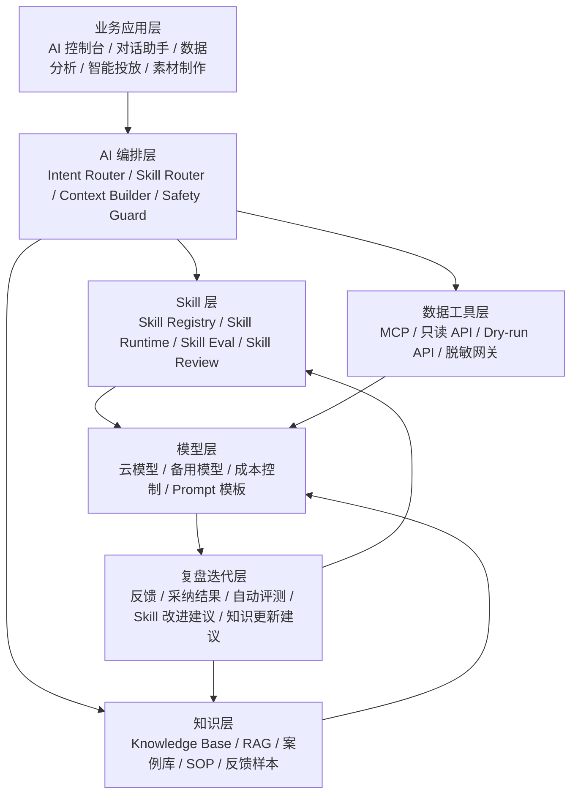

# SSTL 自我复盘迭代型 AI 中台 PRD

## 1. 文档信息

- 文档版本：v1.0
- 创建日期：2026-07-05
- 适用范围：SSTL 投放中台上的 AI 中台、知识库、Skill 管理注册、AI 数据分析、智能投放、素材制作能力
- 目标读者：老板、产品、设计、前端、后端、算法/AI、测试、投放运营负责人
- 关联文档：
  - `docs/sstl-ai-platform-prd.md`
  - `docs/sstl-detailed-product-prd.md`
  - `docs/v1-technical-design.md`

## 2. 产品定位

SSTL AI 中台要建设成一个可以“持续吸收投放知识、沉淀团队方法论、自动选择 Skill、分析实时数据、生成建议、复盘结果并自我迭代”的智能运营系统。

一句话定位：

> AI 中台是 SSTL 投放业务的大脑层，负责把实时数据、投放经验、业务 SOP、Skill 工具和反馈结果组织起来，让 AI 每次分析都知道“该看什么数据、该用什么知识、该调用什么 Skill、该给什么建议、该如何复盘自己是否判断正确”。

### 2.1 核心原则

- 知识库和 Skill Registry 必须做到 AI 中台内部，作为一等核心模块管理。
- AI 每次分析不能只依赖通用模型记忆，必须通过知识检索、Skill 路由和实时数据调用动态构建上下文。
- AI 可以生成建议、生成 Skill 草稿、生成自动化规则草稿，但高风险动作必须人工确认。
- AI 的每次结论都要可解释、可追溯、可反馈、可复盘。
- AI 的能力提升优先通过知识库、Skill、Prompt、评测集和反馈闭环迭代，不优先做大模型微调。

## 3. 建设目标

### 3.1 一期目标

- 建成 AI 知识库，支持投放知识、SOP、复盘、案例、平台规则的上传、审核、标签化、检索和引用。
- 建成 Skill Registry，统一注册、描述、审核、发布、版本管理、测试 AI 可调用的业务 Skill。
- 建成 AI Router，让 AI 根据用户问题自动判断意图，并选择正确 Skill。
- 建成 Context Builder，让 AI 每次调用时自动拼装权限、业务对象、相关知识、Skill 说明、实时数据摘要。
- 建成 AI 数据分析闭环，支持投手、负责人、管理者基于实时数据获得结构化分析结论。
- 建成反馈与复盘闭环，记录 AI 建议是否被采纳、结果是否改善、原因是否正确。

### 3.2 中长期目标

- 逐步扩展到智能投放：预算建议、出价建议、Campaign 暂停建议、Offer 权重建议、自动化规则草稿。
- 逐步扩展到素材制作：素材脚本、分镜、文案、素材评分、素材复用建议、素材衰退识别。
- 建立 AI 自评估系统：自动检测回答质量、Skill 调用是否正确、知识引用是否过期、建议是否有效。
- 建立业务专家型 AI：能结合历史经验、实时数据和团队 SOP，指导投手做更好的搜索套利投放决策。

## 4. 总体架构

AI 中台分为 7 层：



### 4.1 业务应用层

面向用户的页面和工作流：

- AI 控制台。
- AI 数据分析。
- 投手经营分析。
- AI 对话助手。
- 智能投放助手。
- 素材制作助手。
- Skill 中心。
- 知识库。
- AI 复盘中心。
- AI 审计与成本。

### 4.2 AI 编排层

负责每次 AI 调用的决策过程：

- 识别用户意图。
- 识别分析对象。
- 判断用户权限。
- 选择 Skill。
- 检索知识。
- 调用 MCP 工具。
- 构建 Prompt 上下文。
- 进行安全检查。
- 生成结构化结果。
- 触发自检和反馈记录。

### 4.3 Skill 层

统一管理 AI 可调用的业务能力：

- Skill 注册。
- Skill 审核。
- Skill 发布。
- Skill 版本。
- Skill 测试用例。
- Skill 调用日志。
- Skill 成本统计。
- Skill 质量评估。

### 4.4 知识层

统一管理 AI 需要理解的业务知识：

- 指标口径。
- 投放 SOP。
- 素材制作规范。
- 平台规则。
- 合规政策。
- 历史复盘。
- 成功案例。
- 失败案例。
- 经验问答。
- AI 高质量回答样本。

### 4.5 数据工具层

通过 MCP 或只读 API 访问 SSTL 实时数据：

- Campaign 指标。
- Adset 指标。
- 关键词指标。
- 素材指标。
- Offer 指标。
- 重定向日志。
- TONIC 合规。
- 自动化日志。
- 任务中心。
- 用户权限。

### 4.6 模型层

负责模型调用与成本控制：

- 默认云模型。
- 备用模型。
- Prompt 模板管理。
- Token 成本统计。
- 单次调用限制。
- 用户/团队成本上限。

### 4.7 复盘迭代层

让 AI 能自我改进：

- 用户反馈。
- 建议采纳结果。
- 执行后指标变化。
- AI 自评估。
- Skill 路由准确率。
- 知识命中质量。
- Prompt 改进建议。
- Skill 改进建议。
- 知识更新建议。

## 5. 核心业务闭环

## 5.1 每次 AI 分析的标准流程

```mermaid
flowchart LR
  A["用户问题"] --> B["意图识别"]
  B --> C["权限与对象识别"]
  C --> D["Skill 路由"]
  D --> E["知识检索"]
  E --> F["实时数据读取"]
  F --> G["上下文构建"]
  G --> H["AI 分析"]
  H --> I["安全与自检"]
  I --> J["结构化结果"]
  J --> K["用户反馈 / 采纳"]
  K --> L["结果复盘"]
  L --> M["优化知识 / Skill / Prompt"]
```



### 5.1.1 用户问题示例

用户问：

- “昨天为什么亏损？”
- “哪些 Campaign 应该暂停？”
- “这个投手最近表现怎么样？”
- “哪些素材还能复用？”
- “TONIC declined 影响哪些投放？”
- “帮我生成一个低 ROI 扫描 Skill。”

### 5.1.2 AI 必须完成的判断

每次回答前，AI Router 必须判断：

- 用户要分析什么业务场景。
- 用户要分析哪个对象。
- 用户是否有权限查看。
- 需要调用哪些 Skill。
- 需要读取哪些实时数据。
- 需要引用哪些知识。
- 结果是否涉及高风险动作。
- 是否需要 dry-run。

## 5.2 自我复盘迭代闭环

AI 不能只“回答完就结束”。每次分析后必须进入复盘链路：

1. 记录 AI 输出的结论、证据、建议动作、置信度。
2. 记录用户是否点击、是否采纳、是否忽略、是否标记错误。
3. 如果建议被采纳，跟踪采纳后 1 天、3 天、7 天指标变化。
4. 判断建议是否有效：
   - ROI 是否改善。
   - profit 是否改善。
   - spend 浪费是否下降。
   - fallback/blocked 是否下降。
   - 素材表现是否改善。
5. 将结果写入反馈样本池。
6. 如果 AI 判断错误，生成改进建议：
   - 知识缺失。
   - Skill 选错。
   - 数据源不足。
   - Prompt 表达不清。
   - 指标口径错误。
   - 业务规则过期。
7. 管理员确认后更新知识库、Skill 或 Prompt。

## 6. 知识库 PRD

## 6.1 页面目标

知识库负责把投放相关知识喂给 AI，并确保 AI 每次分析都能检索到正确、最新、适用的业务知识。

知识库不是简单文档库，而是 AI 的业务记忆系统。

## 6.2 知识分类

| 类型 | 说明 | 示例 |
| --- | --- | --- |
| 指标口径 | 指标定义、计算方式、归因规则 | ROI、critical CPA、RPA、profit_rate |
| 投放 SOP | 日常操作流程和排查流程 | 低 ROI 排查 SOP、高消耗无转化 SOP |
| 素材知识 | 素材制作规范、素材判断标准 | 前 3 秒钩子、口播规范、风险词 |
| 平台规则 | TikTok、TONIC、System1 规则 | TikTok macro、TONIC declined 处理 |
| 业务案例 | 成功/失败案例 | 高 ROI Campaign 复盘、亏损复盘 |
| 自动化规则 | 自动化规则解释和使用边界 | 低 ROI 暂停规则、高 ROI 加预算规则 |
| Skill 说明 | Skill 使用场景和输入输出 | Campaign ROI 诊断 Skill 使用说明 |
| AI 样本 | 高质量回答、错误回答、反馈样本 | 标准日报、错误归因样本 |

## 6.3 知识元数据

每条知识必须包含：

| 字段 | 说明 |
| --- | --- |
| title | 标题 |
| knowledge_type | 指标/SOP/素材/平台规则/案例/自动化/Skill/AI 样本 |
| business_tags | Coupon/Insurance/Utility 等 |
| platform | TikTok/TONIC/System1/SSTL |
| applies_to | Campaign/Adset/Keyword/Offer/Material/Buyer |
| countries | US/CA 等 |
| lifecycle_status | draft/pending_review/published/expired/archived |
| priority | high/medium/low |
| owner | 负责人 |
| effective_from | 生效时间 |
| effective_to | 失效时间 |
| version | 版本 |
| source | 手动上传/AI 复盘生成/系统导入 |
| vector_status | not_indexed/indexing/indexed/failed |
| review_status | pending/approved/rejected |

## 6.4 知识上传方式

支持：

- 手动新建 Markdown。
- 上传 Word/PDF/Markdown/TXT。
- 上传复盘表格。
- 从 AI 分析结果一键保存。
- 从对话问答一键沉淀。
- 从自动化执行结果一键生成案例。
- 从素材分析结果一键生成素材知识。

## 6.5 知识审核

知识进入 AI 可引用范围前必须审核：

- 管理员或业务负责人审核。
- 审核通过后才进入 published。
- 未审核知识只能作为个人草稿，不参与团队 AI 默认检索。
- 过期知识不默认引用，但可被管理员手动查看。

## 6.6 知识检索策略

AI 调用时，知识检索必须考虑：

- 用户问题语义。
- 当前业务对象。
- 用户所属团队。
- 业务标签。
- 国家。
- 平台。
- 知识有效期。
- 知识优先级。
- 历史反馈评分。

检索结果必须返回：

- 知识标题。
- 版本。
- 摘要。
- 引用片段。
- 匹配原因。
- 是否过期。

## 6.7 知识喂养流程

推荐流程：

1. 运营上传 SOP/案例/复盘。
2. 系统抽取标题、摘要、标签、适用对象。
3. AI 生成知识摘要和候选标签。
4. 业务负责人确认。
5. 系统切分 chunk 并向量化。
6. 知识进入 published。
7. AI 回答时可检索引用。
8. 用户反馈引用是否正确。
9. 系统根据反馈调整知识排序。

## 6.8 知识质量评分

每条知识有质量评分：

- 引用次数。
- 有用反馈比例。
- 被采纳建议次数。
- 最近更新时间。
- 是否过期。
- 是否被标记错误。
- 是否与当前指标结果冲突。

低质量知识进入待复审列表。

## 7. Skill Registry PRD

## 7.1 页面目标

Skill Registry 负责告诉 AI：“系统有哪些能力、每个能力适合什么场景、需要什么输入、可以访问什么数据、能输出什么结果、风险等级是什么”。

它是 AI 能否正确调用 Skill 的关键。

## 7.2 Skill 卡片

每个 Skill 必须有结构化卡片：

```json
{
  "code": "campaign_roi_diagnosis",
  "name": "Campaign ROI 异常诊断",
  "description": "分析 Campaign ROI 低、利润下降、消耗异常的原因",
  "intent": ["roi_diagnosis", "profit_loss", "campaign_analysis"],
  "trigger_examples": [
    "昨天为什么亏损",
    "哪些 Campaign ROI 低",
    "帮我分析这个 Campaign 为什么不赚钱"
  ],
  "required_inputs": ["date_range", "campaign_id 或 buyer_id"],
  "optional_inputs": ["country", "business_tag", "owner_id"],
  "data_sources": [
    "campaign_metrics",
    "adset_metrics",
    "keyword_metrics",
    "material_metrics",
    "offer_metrics",
    "redirect_stats"
  ],
  "knowledge_types": ["指标口径", "投放 SOP", "历史案例"],
  "output_schema": [
    "summary",
    "evidence",
    "root_causes",
    "suggested_actions",
    "confidence",
    "dry_run_required"
  ],
  "not_use_when": [
    "用户只问素材制作方法",
    "用户只问 TONIC 合规状态"
  ],
  "risk_level": "medium"
}
```

## 7.3 Skill 类型

- 系统 Skill：平台内置，所有团队可用。
- 团队 Skill：团队沉淀，团队内部可用。
- 个人 Skill 草稿：个人创建，未审核前仅个人可见。
- 实验 Skill：仅测试环境或指定用户可用。
- 已废弃 Skill：不再路由，但保留历史调用记录。

## 7.4 内置 Skill 清单

### 数据分析类

| Skill | 说明 |
| --- | --- |
| `daily_profit_diagnosis` | 日利润异常诊断 |
| `buyer_performance_review` | 投手经营分析 |
| `team_performance_review` | 团队经营分析 |
| `campaign_roi_diagnosis` | Campaign ROI 异常诊断 |
| `adset_no_conversion_scan` | 高消耗无转化 Adset 扫描 |
| `keyword_profit_analysis` | 关键词利润分析 |
| `offer_fallback_analysis` | Offer fallback/blocked 异常分析 |
| `redirect_quality_analysis` | 重定向质量分析 |
| `tonic_compliance_impact` | TONIC 合规影响分析 |

### 智能投放类

| Skill | 说明 |
| --- | --- |
| `pause_candidate_recommender` | 推荐应暂停对象 |
| `budget_adjustment_suggestion` | 预算调整建议 |
| `bid_adjustment_suggestion` | 出价调整建议 |
| `offer_weight_suggestion` | Offer 权重调整建议 |
| `automation_rule_suggestion` | 自动化规则草稿生成 |
| `dry_run_impact_estimator` | 动作影响面评估 |

### 素材制作类

| Skill | 说明 |
| --- | --- |
| `material_decay_detection` | 素材衰退识别 |
| `winning_material_mining` | 高 ROI 素材挖掘 |
| `creative_brief_generator` | 素材 Brief 生成 |
| `video_script_generator` | 视频脚本生成 |
| `hook_copy_generator` | 前 3 秒钩子文案生成 |
| `material_compliance_checker` | 素材合规风险检查 |

### 复盘迭代类

| Skill | 说明 |
| --- | --- |
| `weekly_review_generator` | 周报生成 |
| `case_summary_generator` | 案例沉淀 |
| `ai_answer_self_check` | AI 回答自检 |
| `skill_routing_evaluator` | Skill 路由评估 |
| `knowledge_gap_detector` | 知识缺口识别 |
| `prompt_improvement_suggester` | Prompt 改进建议 |

## 7.5 Skill 注册流程

1. 创建 Skill 草稿。
2. 填写 Skill 卡片。
3. 配置可调用 MCP 工具。
4. 配置输入/输出 schema。
5. 配置 Prompt 模板。
6. 配置测试用例。
7. 运行测试。
8. 提交审核。
9. 管理员审核。
10. 发布。
11. 进入 AI Router 可选 Skill 池。

## 7.6 Skill 审核规则

审核必须检查：

- Skill 描述是否清楚。
- intent 和 trigger examples 是否足够。
- required inputs 是否完整。
- 是否越权访问数据。
- 是否包含禁止动作。
- 输出 schema 是否结构化。
- 是否有测试用例。
- 测试结果是否通过。
- Prompt 是否包含敏感数据。
- 风险等级是否正确。

## 7.7 Skill 版本管理

- 每次修改 Skill 都生成新版本。
- 已发布版本不可直接覆盖。
- 新版本发布后旧版本可保留、停用或灰度。
- 历史 AI 调用必须记录当时使用的 Skill 版本。
- Skill 评分下降时自动进入复审队列。

## 8. AI Router PRD

## 8.1 页面/能力目标

AI Router 是 AI 中台的调度核心。它负责判断用户问题应该调用哪些 Skill，而不是让模型随意猜。

## 8.2 路由输入

- 用户问题。
- 用户身份。
- 用户权限。
- 当前页面上下文。
- 当前选中的对象。
- 日期范围。
- 已发布 Skill 列表。
- Skill 卡片。
- 历史相似问题。

## 8.3 路由输出

- 识别出的意图。
- 分析对象。
- 推荐 Skill 列表。
- Skill 调用顺序。
- 需要的数据源。
- 需要检索的知识类型。
- 风险等级。
- 是否需要用户补充信息。

## 8.4 路由规则

| 用户意图 | 推荐 Skill |
| --- | --- |
| 问亏损原因 | `daily_profit_diagnosis` + `campaign_roi_diagnosis` |
| 问某投手表现 | `buyer_performance_review` |
| 问哪些 Campaign 暂停 | `pause_candidate_recommender` + `dry_run_impact_estimator` |
| 问素材复用 | `winning_material_mining` + `material_decay_detection` |
| 问素材怎么做 | `creative_brief_generator` + `video_script_generator` |
| 问 Offer 异常 | `offer_fallback_analysis` |
| 问 TONIC declined | `tonic_compliance_impact` |
| 要生成规则 | `automation_rule_suggestion` |
| 要沉淀案例 | `case_summary_generator` |

## 8.5 路由失败处理

如果 AI Router 无法确定 Skill：

- 先追问用户补充分析对象或日期。
- 或推荐 2-3 个可能分析方向。
- 不能盲目读取全量数据。
- 不能调用高风险 Skill。

## 8.6 路由评估

每次路由记录：

- 用户问题。
- 选中的 Skill。
- 是否被用户认可。
- 是否重新选择 Skill。
- 最终回答评分。
- 是否产生有效建议。

系统定期计算：

- Skill 路由准确率。
- 无法路由比例。
- 错选 Skill 比例。
- 常见未覆盖意图。

## 9. Context Builder PRD

## 9.1 页面/能力目标

Context Builder 负责确保 AI 每次分析都带上正确上下文，而不是每次只靠用户问题。

## 9.2 上下文组成

每次 AI 调用必须拼装：

- 用户身份与权限范围。
- 当前业务对象。
- 日期范围。
- 相关 Skill 卡片。
- 相关知识片段。
- 实时数据摘要。
- 指标口径。
- 安全规则。
- 输出格式要求。
- 高风险动作限制。

## 9.3 上下文优先级

优先级从高到低：

1. 系统安全规则。
2. 用户权限。
3. 当前页面/对象上下文。
4. Skill 说明。
5. 实时数据。
6. 已发布知识。
7. 历史案例。
8. 用户偏好。

## 9.4 上下文裁剪

如果上下文过长：

- 保留安全规则和权限。
- 保留 Skill 输入输出要求。
- 保留最相关数据摘要。
- 保留高优先级知识。
- 舍弃低相似度案例。
- 不把大表全量塞入 Prompt，只给聚合摘要和必要明细。

## 10. 自我复盘迭代中心 PRD

## 10.1 页面目标

AI 复盘中心让管理员和负责人看到 AI 是否真的在变聪明，哪些建议有效，哪些判断错误，哪些知识和 Skill 需要更新。

## 10.2 页面模块

- AI 表现总览。
- 建议采纳效果。
- 错误归因列表。
- Skill 路由质量。
- 知识引用质量。
- Prompt 改进建议。
- Skill 改进建议。
- 知识缺口。
- 待复审样本。

## 10.3 AI 表现指标

| 指标 | 说明 |
| --- | --- |
| 回答满意率 | 用户有用反馈比例 |
| 建议采纳率 | 建议被采纳比例 |
| 采纳后 ROI 改善率 | 采纳建议后 ROI 改善的比例 |
| 错误归因率 | 用户标记原因错误比例 |
| Skill 路由准确率 | Skill 选择被认可比例 |
| 知识引用准确率 | 引用知识被认可比例 |
| 高风险拦截次数 | 成功阻止直接执行高风险动作次数 |
| 平均成本 | 单次 AI 分析成本 |

## 10.4 改进建议生成

系统定期自动生成：

- 哪些 Skill 描述不清楚。
- 哪些用户问题没有匹配 Skill。
- 哪些知识经常被引用但反馈不好。
- 哪些 SOP 可能过期。
- 哪些 Prompt 输出格式不稳定。
- 哪些分析缺少数据源。

所有改进建议必须人工确认后生效。

## 11. AI 数据分析功能 PRD

## 11.1 目标

实现第一阶段核心价值：AI 能够基于实时投放数据和知识库，输出可解释的数据分析结论。

## 11.2 分析场景

- 昨日亏损归因。
- 今日利润波动。
- 投手经营分析。
- 团队经营分析。
- Campaign ROI 异常分析。
- Adset 高消耗无转化分析。
- 关键词利润分析。
- 素材衰退分析。
- Offer fallback/blocked 分析。
- TONIC declined 影响分析。

## 11.3 分析结果格式

每次分析必须输出：

- 总结结论。
- 核心问题。
- 影响金额。
- 证据表。
- 原因排序。
- 建议动作。
- 置信度。
- 使用的 Skill。
- 使用的知识。
- 使用的数据源。
- 是否建议 dry-run。

## 11.4 数据证据要求

结论必须引用至少一种实时数据证据：

- 指标变化。
- 对比基准。
- 对象明细。
- 趋势变化。
- 异常日志。
- 合规状态。
- 自动化记录。

没有数据证据时，AI 必须明确说明“当前数据不足，不能下结论”。

## 12. 智能投放功能 PRD

## 12.1 目标

在 AI 数据分析稳定后，逐步让 AI 参与半自动投放决策。

## 12.2 一期范围

一期只做建议和 dry-run：

- 暂停候选 Campaign。
- 暂停候选 Adset。
- 加预算候选对象。
- 降预算候选对象。
- 出价调整建议。
- Offer 权重调整建议。
- Campaign 切兜底建议。
- 自动化规则草稿。

## 12.3 高风险动作约束

以下动作必须人工确认：

- 暂停/启用 Campaign。
- 暂停/启用 Adset。
- 调预算。
- 调出价。
- 调转化出价。
- 暂停 Offer。
- 调整 Offer 权重。
- Campaign 切兜底。
- 跨账号复制。
- 批量建计划。

## 12.4 Dry-run 输出

每次 dry-run 必须展示：

- 影响对象。
- 当前状态。
- 建议动作。
- 命中规则。
- 预计影响金额。
- 风险等级。
- 失败可能原因。
- 回滚建议。
- 是否需要二次确认。

## 13. 素材制作功能 PRD

## 13.1 目标

让 AI 基于素材表现数据、素材库、素材 SOP 和成功案例，辅助素材团队生产更适合搜索套利投放的素材。

## 13.2 功能范围

- 素材表现诊断。
- 高 ROI 素材挖掘。
- 素材衰退检测。
- 素材复用建议。
- 素材 Brief 生成。
- 视频脚本生成。
- 前 3 秒 hook 文案生成。
- 图片文案生成。
- 多国家/多关键词适配建议。
- 素材合规风险检查。

## 13.3 素材制作输入

- 业务标签。
- 国家。
- 关键词。
- Offer。
- 目标人群。
- 历史高 ROI 素材。
- 禁用表达。
- 平台规则。
- 素材时长。
- 素材形式：图片/视频/口播/混剪。

## 13.4 素材输出

- 素材 Brief。
- 视频结构。
- 分镜脚本。
- Hook 文案。
- CTA 建议。
- 风险词提示。
- 适用 Campaign/关键词。
- 参考素材。
- 预估风险等级。

## 13.5 素材反馈

素材上线后必须回流：

- spend。
- revenue。
- profit。
- ROI。
- CTR。
- CVR。
- 播放率。
- 素材疲劳时间。
- 是否被复用。

这些反馈用于优化素材制作 Skill。

## 14. 核心页面信息架构

建议 AI 中台导航：

- AI 控制台
- AI 对话助手
- AI 数据分析
- 投手经营分析
- 智能投放助手
- 素材制作助手
- Skill 中心
  - Skill Registry
  - Skill 草稿
  - Skill 审核
  - Skill 测试
  - Skill 版本
- 知识库
  - 知识管理
  - 知识审核
  - 案例库
  - SOP 库
  - 反馈样本
- AI 复盘中心
  - 建议采纳效果
  - 错误归因
  - Skill 路由评估
  - 知识质量评估
- AI 任务中心
- 模型与成本
- AI 审计日志

## 15. 核心数据对象

### 15.1 `AIKnowledgeItem`

- id
- title
- knowledge_type
- content
- summary
- business_tags
- platform
- applies_to
- countries
- priority
- lifecycle_status
- review_status
- vector_status
- version
- owner_id
- effective_from
- effective_to
- created_by
- updated_by
- created_at
- updated_at

### 15.2 `AISkill`

- id
- code
- name
- description
- skill_type
- intent_tags
- trigger_examples
- required_inputs
- optional_inputs
- input_schema
- output_schema
- data_sources
- knowledge_types
- tool_permissions
- prompt_template
- not_use_when
- risk_level
- status
- version
- owner_id
- team_id
- created_by
- updated_by
- created_at
- updated_at

### 15.3 `AISkillRouteLog`

- id
- user_id
- user_question
- detected_intent
- selected_skill_ids
- rejected_skill_ids
- route_confidence
- route_reason
- final_answer_id
- user_feedback
- created_at

### 15.4 `AIContextBuildLog`

- id
- request_id
- user_id
- permission_scope
- business_context
- selected_knowledge_ids
- selected_skill_ids
- data_sources
- prompt_token_count
- trimmed_reason
- created_at

### 15.5 `AIAnalysisResult`

- id
- request_id
- task_type
- target_type
- target_id
- summary
- evidence
- root_causes
- suggested_actions
- confidence
- skill_ids
- knowledge_ids
- data_sources
- dry_run_required
- status
- created_by
- created_at

### 15.6 `AIFeedback`

- id
- target_type
- target_id
- user_id
- rating
- adopted
- actual_result
- feedback_reason
- comment
- created_at

### 15.7 `AIImprovementSuggestion`

- id
- suggestion_type
- target_type
- target_id
- problem_summary
- evidence
- suggested_change
- status
- reviewed_by
- reviewed_at
- created_at

## 16. 权限与安全

### 16.1 权限

- `ai:chat:use`
- `ai:analysis:run`
- `ai:knowledge:view`
- `ai:knowledge:edit`
- `ai:knowledge:review`
- `ai:skill:view`
- `ai:skill:edit`
- `ai:skill:review`
- `ai:skill:test`
- `ai:router:view`
- `ai:feedback:view`
- `ai:improvement:review`
- `ai:cost:view`
- `ai:audit:view`

### 16.2 数据安全

- AI 不直接连接生产数据库。
- AI 只通过 MCP/只读 API 获取数据。
- 高风险动作只能生成 dry-run。
- 真实执行必须走现有自动化/任务中心权限。
- 所有 Prompt 必须经过脱敏。
- 所有知识入库必须经过敏感信息扫描。
- 所有 Skill 发布必须经过审核。

## 17. 版本路线

### V1：知识库 + Skill Registry + AI 数据分析

- 知识库管理。
- Skill Registry。
- Skill 审核。
- AI Router。
- Context Builder。
- AI 数据分析。
- AI 对话助手。
- AI 审计日志。

### V2：自我复盘迭代

- AI 复盘中心。
- 建议采纳跟踪。
- Skill 路由评估。
- 知识质量评分。
- Prompt 改进建议。
- Skill 改进建议。
- 知识缺口识别。

### V3：智能投放助手

- 暂停候选推荐。
- 预算调整建议。
- 出价调整建议。
- Offer 权重建议。
- 自动化规则草稿。
- Dry-run 影响面评估。

### V4：素材制作助手

- 素材 Brief。
- 视频脚本。
- Hook 文案。
- 素材合规检查。
- 高 ROI 素材复用建议。
- 素材表现反馈闭环。

### V5：策略预测与半自动执行

- ROI 预测。
- 素材胜率预测。
- Campaign 风险评分。
- 策略内低风险自动执行。
- 自动回滚建议。

## 18. 验收场景

### 18.1 知识库

- 上传低 ROI 排查 SOP，审核通过后 AI 能在亏损分析中引用。
- 上传过期 TONIC 政策后，AI 不默认引用。
- AI 分析结果可以一键保存为复盘知识草稿。
- 用户标记知识引用错误后，该知识进入复审队列。

### 18.2 Skill Registry

- 管理员可创建 Campaign ROI 诊断 Skill。
- Skill 未审核时不能被普通用户调用。
- Skill 发布后 AI Router 能根据“昨天为什么亏损”选择该 Skill。
- Skill 输出必须符合 output schema。
- Skill 新版本发布后，历史调用仍能看到旧版本。

### 18.3 AI Router

- 用户问“哪些素材还能复用”，AI 选择素材 Skill，不调用 Campaign 暂停 Skill。
- 用户问“TONIC declined 影响哪些投放”，AI 选择合规影响分析 Skill。
- 用户问题缺少日期时，AI 追问或使用默认日期范围并说明。
- 用户无权限时，AI 不读取越权数据。

### 18.4 数据分析

- AI 能分析某投手近 7 天 spend、revenue、profit、ROI。
- AI 能列出亏损 Campaign 和数据证据。
- AI 能说明使用了哪些 Skill、知识和数据源。
- AI 不能在没有证据时给确定结论。

### 18.5 智能投放

- AI 推荐暂停 Campaign 时只能生成 dry-run。
- Dry-run 展示影响对象、原因、预计影响金额、风险和回滚建议。
- 用户确认后才进入现有任务中心或自动化执行流程。

### 18.6 素材制作

- AI 能基于高 ROI 素材生成新的素材 Brief。
- AI 能根据素材 SOP 提醒风险词。
- 素材上线后的 ROI、CTR、CVR 能回流到素材 Skill 反馈。

### 18.7 自我复盘

- AI 建议被采纳后，系统跟踪 1 天、3 天、7 天效果。
- 错误建议进入错误归因列表。
- 系统能生成 Skill 改进建议和知识缺口建议。
- 管理员审核后才能更新 Skill 或知识。

## 19. 默认假设

- 知识库、Skill Registry、Skill 审核、Skill 路由必须做到 AI 中台内部。
- 第一期重点不是自动执行，而是让 AI 具备正确业务知识、正确 Skill 调用能力和可靠数据分析能力。
- 所有高风险业务动作必须人工确认。
- 不直接微调大模型，优先用知识库、Skill、Prompt、评测集、反馈闭环提升 AI 能力。
- AI 生成的知识、Skill、规则都先作为草稿，审核后才能进入团队可用范围。
- AI 自我复盘产生的是改进建议，不自动修改生产 Skill 或知识。

