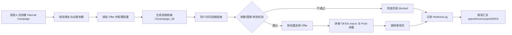

# V1 技术设计：内部 Campaign + Offer 分发闭环

## 1. 范围

V1 只实现 P0 闭环：

- Offer 管理
- 内部 Campaign 管理
- Campaign 与 Offer 权重绑定
- 投放链接 `/r/{campaign_id}`
- 重定向日志
- 基础收益指标计算
- 自动化 dry-run 所需的数据结构预留

## 2. 业务流程

## 3. 模块设计

### 3.1 Offer 管理

页面能力：

- 列表：名称、平台、落地页、Pixel 注入、标签、绑定 Campaign 数、状态、更新时间。
- 筛选：名称、平台、标签、状态。
- 操作：新增、编辑、启用/停用、查看绑定 Campaign。

服务能力：

- Offer CRUD。
- 校验落地页 URL。
- 当 `inject_pixel=true` 时，必须配置 `pixel_id` 或 `pixel_param_name`。

### 3.2 内部 Campaign 管理

页面能力：

- 列表：Campaign ID、名称、投放链接、域名、标签、Offer 数、反跟踪状态、状态。
- 筛选：名称、Campaign ID、域名、标签、状态。
- 操作：新增、编辑、复制投放链接、启用/停用、权重配置。

服务能力：

- 自动生成唯一 `campaign_id`，默认使用 10 位大写字母数字。
- 投放链接格式：`https://{tracking_domain}/r/{campaign_id}`。
- `check_params` 默认：`ttclid`、`campaign_id`、`ad_id`。
- `macro_params` 默认：TikTok 常用 macro 参数列表，由配置表维护。

### 3.3 Campaign Offer 权重

规则：

- 一个 Campaign 至少绑定 1 个启用 Offer 才能启用。
- 权重为正整数，总和不强制等于 100，按比例计算。
- 停用 Offer 不参与分发。
- 同一 Campaign 下不能重复绑定同一 Offer。

选择算法：

- V1 使用加权随机。
- 后续可升级为基于收益、国家、设备、合规状态的智能调度。

### 3.4 重定向服务

入口：

- `GET /r/{campaign_id}`

核心判断：

- Campaign 不存在或停用：记录 `blocked`，跳兜底。
- 必需参数缺失：记录 `blocked` 或 `fallback`。
- 国家不在目标范围：记录 `fallback`。
- 无可用 Offer：记录 `fallback`。
- 通过校验：按权重选 Offer，记录 `normal`。

日志字段：

- `hit_id`：每次访问唯一 ID。
- `visitor_id`：基于 cookie 或指纹生成，V1 可用 cookie UUID。
- `redirect_type`：`normal`、`fallback`、`blocked`、`enhanced`。
- `suspicious_reason`：参数缺失、Campaign 停用、无可用 Offer、国家不匹配等。

### 3.5 收益指标

统一指标：

- `spend`：广告消耗。
- `revenue`：上游收益。
- `profit = revenue - spend`。
- `roi = revenue / spend`，spend 为 0 时返回 0。
- `profit_rate = profit / revenue`，revenue 为 0 时返回 0。
- `rpm = revenue / impressions * 1000`。
- `rpa = revenue / conversions`。
- `critical_cpa = revenue / conversions`，无 conversion 时返回 0。

V1 要求：

- Campaign 报表先支持这些字段的计算与展示。
- 关键词和素材报表可先复用同一计算函数，逐步接入。

## 4. API 设计

详见 `docs/v1-openapi.yaml`。

统一约定：

- 列表接口支持 `page`、`pageSize`。
- 状态字段使用 `active`、`inactive`。
- 所有写操作记录审计日志。
- 所有返回时间使用 `YYYY-MM-DD HH:mm:ss` 或 ISO8601，按现有 SSTL 口径统一。

## 5. 权限

- `traffic:offer:view`
- `traffic:offer:edit`
- `traffic:campaign:view`
- `traffic:campaign:edit`
- `traffic:redirect-log:view`
- `traffic:automation:dry-run`

管理员默认拥有全部权限。

## 6. 迁移策略

- 不改动现有域名、文章、样式、素材、报表表结构。
- 新增表独立上线。
- 现有 Campaign 报表只新增字段展示，不改变原有查询参数。
- 自动化 V1 只做 dry-run 数据结构预留，不执行真实广告动作。

## 7. 风险

- 跳转服务在高并发下会成为核心链路，必须缓存 Campaign 和 Offer 配置。
- 权重随机要避免数据库锁和全表扫描。
- 日志量会增长很快，建议按天分区或至少保留归档策略。
- 凭证与 Pixel 参数不能在日志中泄露完整敏感值。

## 8. 验收

- 创建 Campaign 后能复制投放链接。
- Campaign 绑定两个 Offer，权重 70/30，访问 1000 次分布误差在可接受范围。
- 缺少 `ttclid` 时记录 blocked 或 fallback。
- 日志列表能按 Campaign、Offer、国家、类型筛选。
- Campaign 报表正确显示 spend、revenue、profit、ROI、RPM。
